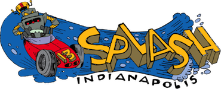

Miniboxing is a research project at [EPFL](http://lamp.epfl.ch) aimed at improving the performance of generic code in the [Scala programming language](http://scala-lang.org). The current implementation is a Scala compiler plugin, which can [speed up generics by up to 22x](benchmarks.html) when they are used for numeric types, such as integer or double.

You can learn more about miniboxing by reading the [introduction](intro.html), going through the [benchmarks](benchmarks.html) and digging into the [transformation details](transformation.html).

If you want to use miniboxing in your project, see the [quick start page](quick-start.html).

 

#  News

* _ 24 Oct 2013_ -- [Miniboxing will be presented at the SPLASH 2013 conference, in Indianapolis, 26th-31st of October!](http://infoscience.epfl.ch/record/188060) 
* _16 Oct 2013_ -- Site is online!
